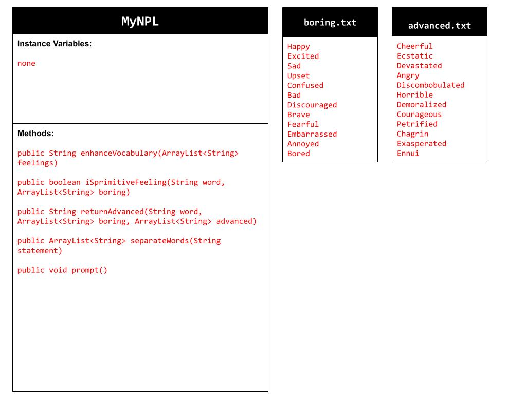
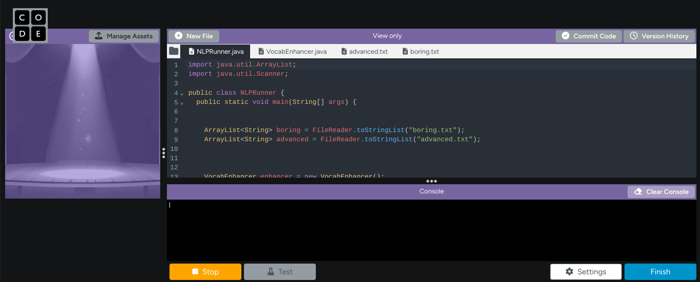

# Unit 6 - Natural Language Processing Project

## Introduction

Natural language processing (NLP) is used in many apps and devices to interact with users and make meaning of text to determine how to respond, find information, or to create new text. Your goal is to use natural language processing techniques to identify structure, patterns, and meaning in a text to have conversations with a user, execute commands, perform manipulations on the text, or generate new text.

## Requirements

Use your knowledge of object-oriented programming, ArrayLists, the String class, and algorithms to create a program that uses natural language processing techniques:

- **Create at least two ArrayLists** – Create at least two ArrayLists to store the data used in your program, such as data from text files or entered by the user.
- **Implement one or more algorithms** – Implement one or more algorithms that use loops and conditionals to find or manipulate elements in an ArrayList or String object.
- **Use methods in the String class** - Use one or more methods in the String class in your program, such as to divide text into sentences or phrases.
- **Use at least one natural language processing technique** – Use a natural language processing technique to process, analyze, and/or generate text.
- **Document your code** – Use comments to explain the purpose of the methods and code segments and note any preconditions and postconditions.

## UML Diagram

## Video

## Project Description

As natural language processing highlights technological analysis and interpretation, our application analyzes user input of emotion words and returns advanced synonyms. By using text files of "basic" words corresponding to "advanced" synonyms, the program we made effectively uses mutability, text segmentation, and String methods to traverse through several words inputted by the user and replace them where need be. 

## NLP Techniques

Our project allows mentions of specific words of user input to be interpreted and changed. By applying computer analysis, user input can be examined and changed depending on what specific words are recognized. For example, the separateWords() method allows the program to separate sentences into individual words through using indexOf(); whenever there is a space, a new word will be added to a new ArrayList. In addition, the enhanceVocabulary() method allows each word to analyzed and replaced were necessary. These methods were necessary for breaking down the structure of each inputted sentence and replacing specific words. 